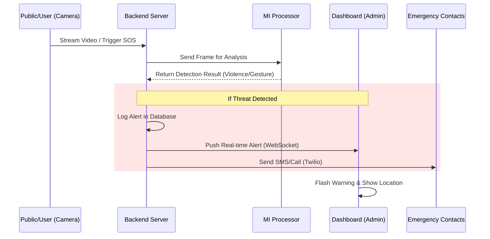
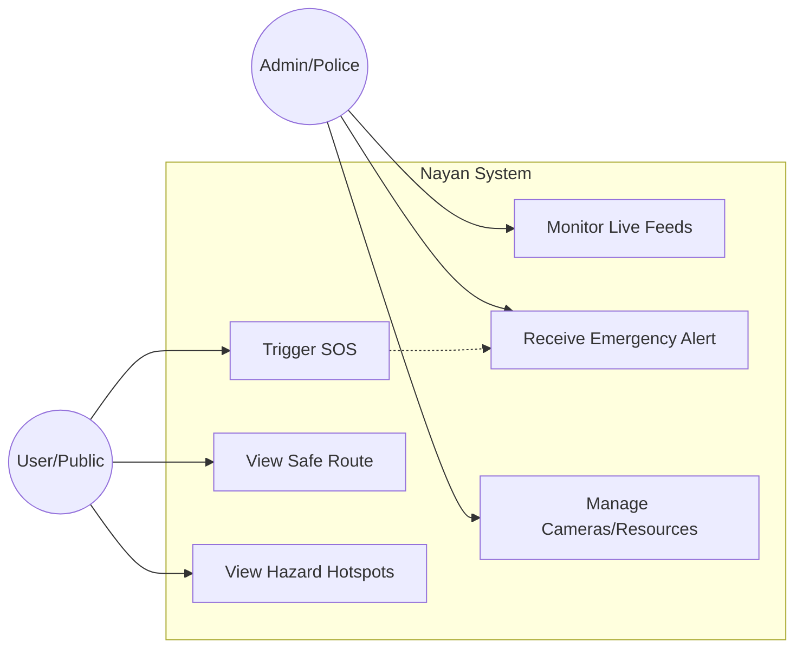

# Nayan: Protecting Women from Safety Threats

Nayan is an AI-powered safety ecosystem designed to enhance women's safety in urban environments. By integrating real-time threat detection, automated alerts, and a community-based safety network, it bridges the gap between citizens and emergency services. The system leverages advanced Computer Vision, Machine Learning, and IoT technologies to create a proactive safety net.


## 🚀 Key Features

*   **Real-time Threat Detection:** AI models analyze live video feeds to detect SOS gestures (e.g., open palm, tucked thumb) and potential violence.
*   **Smart Surveillance:** Automated gender classification and crowd density analysis (Gender Ratio) to identify potential risk zones in real-time.
*   **Hotspot Mapping:** Dynamic identifying of high-risk areas based on historical data and live analytics, alerting users when they enter these zones.
*   **Emergency SOS:** One-touch activation that triggers:
    *   Instant SMS/Call to emergency contacts.
    *   Live location sharing with law enforcement (112 integration).
    *   Visual and audio alerts on the monitoring dashboard.
*   **Safe Mode:** Continuous background monitoring that tracks location and status, automatically triggering alerts if anomalies are detected (e.g., prolonged inactivity, route deviation).
*   **Interactive Dashboard:** A centralized command center for authorities to view live camera feeds, track active SOS alerts on a map, and manage resources.
*   **Mobile App:** A user-friendly application for women to access safety tools, view nearby safe zones (hospitals, police stations), and report incidents.

## 🏗️ System Architecture

The system operates on a client-server model where multiple video sources (Mobile Phones, CCTV) feed data to a central processing unit. The analyzed data is then distributed to the Command Center Dashboard and the User Application.

```mermaid
graph TD
    subgraph "Data Sources"
        CCTV[CCTV Cameras] -->|RTSP Stream| Backend
        MobileApp[User Mobile App] -->|Video/Location/SOS| Backend
    end

    subgraph "Backend Core (FastAPI)"
        Backend[FastAPI Server]
        ML_Engine[AI/ML Engine]
        DB[(Database - Supabase/Postgres)]
        
        Backend <--> ML_Engine
        Backend <--> DB
    end

    subgraph "AI/ML Engine"
        YOLO[YOLOv8 Detection]
        MediaPipe[MediaPipe Gesture]
        OpenCV[OpenCV Processing]
        
        ML_Engine --> YOLO
        ML_Engine --> MediaPipe
        ML_Engine --> OpenCV
    end

    subgraph "Clients"
        Dashboard[Admin Dashboard (React)]
        Police[Emergency Services (112)]
        User[User App (React Native)]
    end

    Backend -->|WebSocket/Alerts| Dashboard
    Backend -->|SMS/API| Police
    Backend -->|Notifications| User
```

## 🛠️ Technology Stack

| Component | Technology | Description |
| :--- | :--- | :--- |
| **Backend** | Python, FastAPI | High-performance API server handling requests and WebSocket connections. |
| **AI/ML** | YOLOv8, MediaPipe, OpenCV | Real-time object detection, gesture recognition, and image processing. |
| **Database** | Supabase (PostgreSQL) | Stores user data, alert logs, and camera configurations. |
| **Mobile App** | React Native (Expo) | Cross-platform mobile application for Android and iOS. |
| **Frontend** | React.js, Bootstrap | Admin dashboard for monitoring and analytics. |
| **Maps** | Leaflet, Google Maps API | Visualization of hotspots, cameras, and live tracking. |
| **Communication**| WebSocket, Twilio | Real-time data streaming and SMS/Call dispatch. |

## 🔄 Data Flow

This sequence reflects the lifecycle of an SOS event or Threat Detection.



## 📱 Use Cases



## ⚙️ Installation & Setup

### Prerequisites
*   Node.js (v18+)
*   Python (v3.9+)
*   Expo CLI

### 1. Backend Setup
```bash
cd backend
# Create virtual environment (optional but recommended)
python -m venv venv
# Windows
.\venv\Scripts\activate
# Linux/Mac
source venv/bin/activate

# Install dependencies
pip install -r requirements.txt

# Run the server
uvicorn main:app --reload
```

### 2. Dashboard Setup
```bash
cd dash_frontend
npm install
npm start
# accessible at http://localhost:3000
```

### 3. Mobile App Setup
```bash
cd app
npm install
npx expo start
# Scan the QR code with Expo Go app on your phone
```

## 👥 Team

*   **Aditya Sahu** - AI/ML Lead
*   **Joy Banerjee** - Cloud & DevOps
*   **Aman Hussain** - Data Analyst
*   **Nausheen** - Mobile App Developer

## 💡 Inspiration & Credits

We have drawn significant inspiration from **Team Boka** and their project *Sakhi Sahayak*. We are actively contributing to their original vision by transforming it into a fully production-ready product.

**Our Key Contributions:**
*   **Live Feed Integration:** Moving beyond mock data to support real-time video processing from live cameras.
*   **Robust Backend Architecture:** Re-engineering the backend to handle high-concurrency WebSocket streams and API requests ensuring reliability.
*   **Mobile-Web Integration:** Seamlessly connecting the mobile user application with the centralized web dashboard for unified situational awareness.
